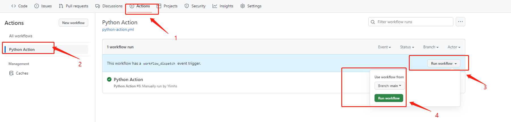
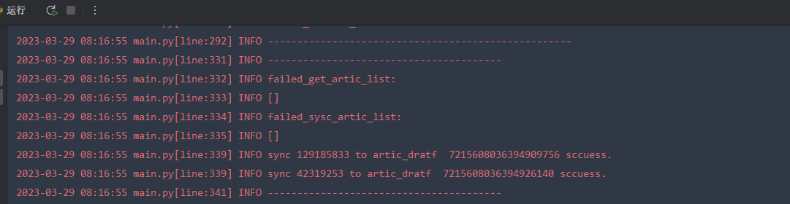
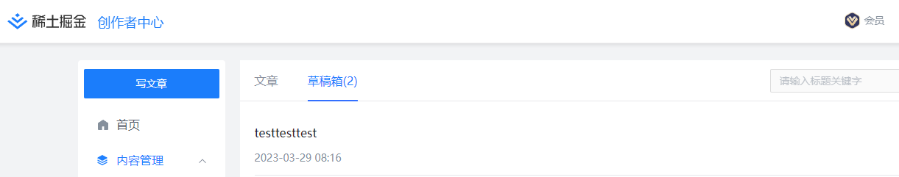
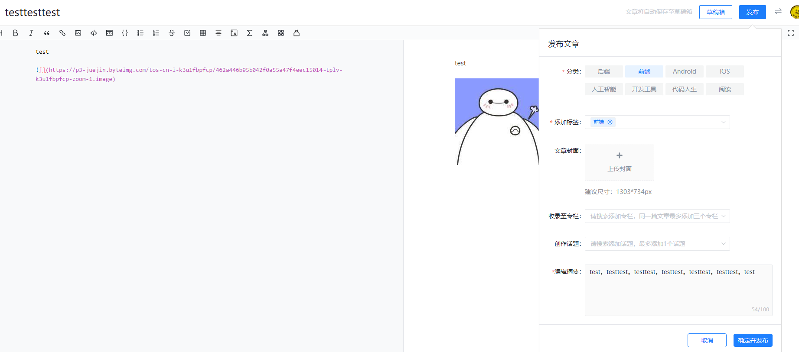
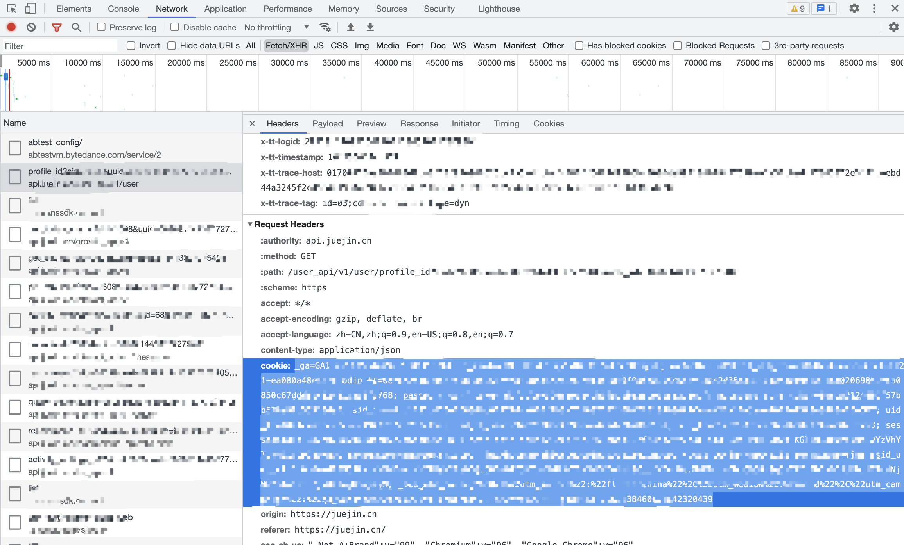

<section align="center">
  
</section>

<h1 align="center">Sync-artic-to-Juejin-稀土掘金文章迁移助手</h1>

迁移CSND文章到稀土掘金

## 如何使用?
使用自动化工作流有两种方式：快速使用(在线) 和 私有化部署(本地)

- 快速使用自动化：[阅读 使用](#使用)
- 可以本地执行： [阅读 本地执行](#本地执行)

## 使用

自动化执行任务: 自定义时间执行或者手动执行github Action
自动化运行时间: 默认注释，自我开启如需使用

1. [Fork 仓库](https://github.com/Ylimhs/Sync-artic-to-Juejin)

2. 仓库 -> Settings -> Secrets -> New repository secret, 按照`config/.env.bak`添加Secrets变量如下:

    | Name | Value                                                               | Required |
    |---------------------------------------------------------------------|----------| --- |
    | CSND_COOKIE | CSDN网站Cookie                                                        | 是        |
    | JUEJIN_COOKIE | 掘金用户Cookie                                                          | 是        |
    | SYNC_TO_DRAFT | 是否迁移到草稿箱 False:直接发布  True：同步到掘金草稿箱  默认True                          | 否        |
    | CSND_ARTIC_STATUS | 需同步的CSND文章状态：all: 全部 enable：全部可见 private：仅我可见 draft：草稿箱   默认 enable | 否        |

4. 仓库 -> Actions, 检查Workflows并启用。
> 直接手动执行
    
5. 如果需要定时执行，请暂时自行修改 `.github/workflows/python-action.yml` 文件

## 注意事项：
- 为了保证图片转存无水印，请在CSDN设置关闭文章水印
- 目前同步到掘金，默认文章分类和标签为前端，自定义配置后续完善 可以自行在`api/JuejinApi.py` 下的`create_article_draft`和`update_article_draft`函数下直接更改
`category_id`和`tags_id`的值。**注意自己账号的可选tags数量**

## 本地执行：
## 环境
> python >= 3.9  其他环境我没试过~~
1. 下载项目 或 [ clone the repo:](https://github.com/Ylimhs/Sync-artic-to-Juejin)
2. 安装python依赖
    > pip install -r requirements.txt
3. Copy `config/.env.bak` 文件为 `config/.env` 并填写相应的参数
4. 执行 `main.py`
   > python main.py

## 预览
### Action 执行
~~待更新~~

### 本地执行

## 问题

### 如何获取Cookie

掘金网站Cookie, 打开浏览器，登录 [掘金](https://juejin.cn/), 打开控制台DevTools(快捷键F12) -> Network，复制 cookie。

DevTools截图:

## 贡献

这个项目的存在要感谢所有做出贡献的人。 请先阅读 [[Contribute](CONTRIBUTING.md)]。  
您可以将任何想法作为 [拉取请求](https://github.com/Ylimhs/Sync-artic-to-Juejin/pulls) 或 [GitHub问题](https://github.com/Ylimhs/Sync-artic-to-Juejin/issues) 提交。

## 许可

[GPL](./LICENSE)
