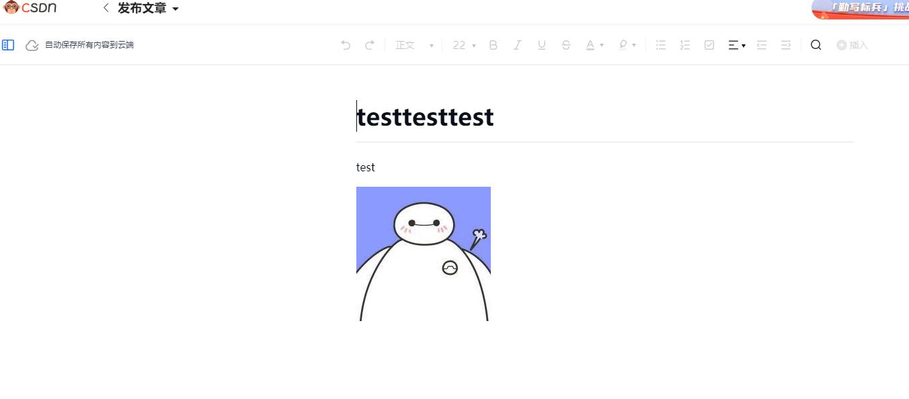

## 本地执行：
## 环境
> python >= 3.9  其他环境我没试过~~
1. 下载项目 或 [ clone the repo:](https://github.com/Ylimhs/Sync-artic-to-Juejin)
2. 安装python依赖
    > pip install -r requirements.txt
3. Copy `config/.env.bak` 文件为 `config/.env` 并填写相应的参数
4. 执行 `main.py`
   > python main.py

### 本地执行

